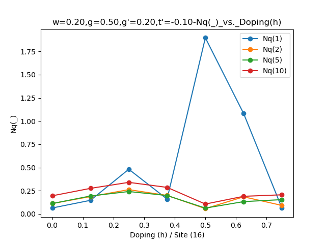

Phonon Database
========================
Author: Matt Myers (Clemson University)
------
Update Date: June 6, 2022

---
## Function of the codes:
This program is split into three main files:

- `options.py` gives the global program options, the choices decide the length and complexity of the run.
  
- `make_database.py` is the main program that takes in the data, filters out directories that lack information, organize the findings into a dictionary, creates desired figures specified in `options.py`, and finally creates the database using __mongoDB__.

- `data_funcs.py` is the program housing all of the functions utilized in the main program. The combination of `options.py` and `datafuncs.py` allow the main program `make_database.py` to run correctly.

---
## Input and Output
### Options:
`options.py` gives the global program options, the root directory is where the program will look for the data this is the input for `make_database.py`. The subfolders do not matter just the parent folder. **Note**: there should be a __\\\\__ between directories because one acts as the escape character.
```
# Root directory
rootdir = 'C:\\******\\******\\******\\******\\******\\****\\******'

# Options
cmap = True or False
figs = True or False
upload = True or False
```
The options input file contain the optional aspects of the program. The options are boolean so either *True* or *False* would be the choices.

- `cmap` - the option that tells the main program whether to create a colormap or not
- `figs` - the option that tells the main program whether to create doping versus various parameter graphs
- `upload` - the option telling the main program to either upload the information to the database or not. This is helpful for debugging other aspects of the program.
  
### Input:
All the raw data should be organized into a directory. This directory will be the `rootdir` parameter in the `options.py` file. The program scans through all of the subdirectories so only having the parent folder will work well for this program.  

### Ouput:
Depending on the opitions in `options.py` the output will vary. Below I will show the variety of output expected from the above options. 

- `cmap` = True: This will create a directory named __map_folder__ that contains directories organized by t' and then further by doping. Within these subfolders there will be two of every desired parameter plus two. There will be a `.png` and `.eps` for each parameter plus a set of `.png` and `.eps` that contains all parameters. 
  - Specfic parameter
  - 
  - All together
  - 

- `figs` = True: This will create a directory named __figure_folder__ that contains directories organized by w, g, g', and t'. Within these subfolders there will be two of every desired parameter plus two and a pdf. There will be a `.png` and `.eps` for each parameter plus a set of `.png` and `.eps` that contains all parameters. The pdf has all of the other figures in one image. 
  - Specfic parameter
  - 
  - All together
  - 
  - PDF
  - 

- `upload` = True: This will upload all the data to the choosen __MongoDB__ service. The cloud had previously been in use for ease of access but there is also an easy local option included.
  - 

---
## **Running**
### <u>**Libraries**</u>
__`win32api`__:
```
    pip install pywin32
```
__`certifi`__:
```
    pip install certifi
```
__`pymongo`__:
```
    pip install pymongo
```
__`numpy`__:
```
    pip install numpy
```
__`matplotlib`__:
```
    pip install matplotlib
```
__`fpdf`__:
```
    pip install fpdf
```
### <u>**Breakdown**</u>
The main code can be broken down into four main parts, filtering, dictionary creation, figure creation, and database creation.

#### <u>**Filtering**</u>
Filtering data by only finding directories with certain files. These files are neccessary for the program to run correctly.
```
needed_files = ['mylog','nonGaussED_eq_observables.txt', 'observableList.txt',    
                'varState.txt']
additional_dir = ['observable_name_list.txt','mylog',
                  'nonGaussED_eq_observables.txt', 'NGSED_iteration_variables.txt']
blacklist_dir = ['unconverged','without inversion symmetry','__MACOSX',
                 'NGSvariationalParams','old correct data', 'WarmUp',
                 'old data','withTprData','incompleted', 
                 'data assuming inversion symmetry', 'new','HubbardCal',
                 'U0allk','correct data without Delta','copy','backup']
```
- `needed_files` - a list of all the files that are neccessary for the program to run correctly.
- `additonal_dir` - a list of possible alternative directory names. If the program comes across a directory that isn't in `needed_files` but is in `additional_dir` it will use that.
- `blacklist_dir`- a list of directories specifically not to include. If the program runs into one it will just skip over it saving time and resources.

The choosen filtering information is sent into a function contained in `data_funcs.py`.
```
all_paths = df.dir_path_find(needed_files, blacklist_dir, additional_dir)
```

The following function takes in the three lists and then begins scanning through the provided root directory `rootdir`. The program loops through each folder, subfolder, and file creating a list for each. It then loops through each file and checks if it is a file in `needed_files` or `additional_dir`. If it is it appends the path to the file to `want_paths`. Then once it loops through every directory it returns the list of paths. 
```
def dir_path_find(nfiles, blacklist, addfiles):
    count = 0
    want_paths = []
    # Getting the starting path and checking
    path = Path(os.getcwd())
    
    # Looping through the files and folders to find the desired files
    for root, dirs, files in os.walk(path):
        for file in files:
            if file in nfiles and (all((i in files for i in nfiles)) or all((i in files for i in addfiles))) and not any(x in root for x in blacklist):
                want_paths.append(root)
                count += 1
                break
        else:
            continue
    
    return(want_paths)
```
#### <u>**Dictonary Creation**</u>
__MongoDb__ uses dictionaries of information for each datapoint. For the purpose of the database creation the code takes in the paths and creates dictionaries for each path then creates a list of dictionaries for the purpose of being uploaded.

The program goes through each path in the list of paths that have the desired data and extracts the data from the directory. It then organizes this data into a dictionary and append it to the list of dictionaries.
```
# Going through each filtered path and extracting the data
data_list = []
for all_path in all_paths:
    # Setting the path to the desired directory
    os.chdir(all_path)
    data_list.append(df.make_dict_from_data(all_path))
```
Dissecting the function that is used for converting the directories files into one coherent dictionary:
1. Loop through each file in the desired path getting a specific path

```
    file_paths = []
    
    # Finding the file paths
    for root, dirs, files in os.walk(path):
        for file in files:
            file_paths.append(os.path.join(root,file))
```
2. Loop through each file path doing the desired operation based on specific file
- `varState.txt`
  - For `varState.txt` we only want the last line so this extracts the last line and then converts all of the data to floating point numbers.
```
if os.path.basename(file_path) in ['varState.txt', 'NGSED_iteration_variables.txt']:
    file_contents_vars = f.readlines()
    file_contents_var = get_last_line(file_contents_vars, "var")
    convert_to_float(file_contents_var)
```
- `observableList.txt`
  - `observableList.txt` is a list of all the observable names each observalble name is extracted and organized in a way that is easy to use.
```
elif os.path.basename(file_path) in ['observableList.txt', 'observable_name_list.txt']:
    file_contents_obs = re.split(r'\t+',f.readline().rstrip('\n'))
```
   - `nonGaussED_eq_observables.txt`
     - we do the exact same thing as `varState.txt` except the contents are checked NaN before trying and convert the numbers to floating point numbers or else an error will be thrown.
```
elif os.path.basename(file_path) == 'nonGaussED_eq_observables.txt':
    file_contents_gausss = f.readlines()
    file_contents_gauss = get_last_line(file_contents_gausss, "gauss")
    if np.nan in file_contents_gauss:
        pass
    else:
        convert_to_float(file_contents_gauss)
```
   - `myLog`
     - There is some information that is only extractable from `myLog` the desired information to be included is the date in which the job was run and also the dimensons and size of the job.
```
elif os.path.basename(file_path) == 'mylog':
    file_contents_log = f.readlines()
    file_date = get_date(file_contents_log)
    file_dim, file_size = get_dim_and_size(file_contents_log)
```
3. Adding missing information
   - There are some header information that was not included so these labels are created and added to the list in the correct order
```
# Creating the header elements not included
header_elems_to_add_end1 = []
header_elems_to_add_end2 = []
for x in range(16):
    header_elems_to_add_end1.append('G('+ str(x)+')')
    header_elems_to_add_end2.append('L('+ str(x)+')')
header_elems_to_add_end = header_elems_to_add_end1 + header_elems_to_add_end2
header_elems_to_add_begin = ['E', 'Ee', 'Eph']
```
4. All this seperated data is now combined into one coherent set
   - The header is combined with the actual data creating a dictonary `file_dict` with the header acting as the keys and the data acting as the values. Finally the entire dictionary is returned to the main function being appended to the list of dictionaries. This process repeats for each directory.
```  
# Combing the data and header information to create a complete set
if len(file_contents_gauss) == 99:
    file_contents_header = header_elems_to_add_begin + file_contents_obs + header_elems_to_add_end
    file_contents_data = file_contents_gauss
else:
    file_contents_header = header_elems_to_add_begin + file_contents_obs + header_elems_to_add_end
    file_contents_gauss, file_contents_var = fill_nan(file_contents_gauss,file_contents_var,header_elems_to_add_begin + file_contents_obs,header_elems_to_add_end)
    file_contents_data = np.append(file_contents_gauss, file_contents_var)
file_dict = dict(zip(file_contents_header, file_contents_data))

# Data being converted into a dictionary
#short_path = path[path.find(get_final_dir(path))+len(get_final_dir(path)):]   
short_path = path[path.find('\\All_data')+len('\\All_data'):]   
data1 = {"Full Path": path, "Date": file_date, "Short Path": short_path}
#add_data = {'Dimension': file_dim, 'Size': file_size, 't\'': 0}
add_data = {'Dimension': file_dim, 'Size': file_size}
path_data = get_path_data(root)

return(dict(list(data1.items()) + list(add_data.items()) + list(path_data.items())  + list(file_dict.items())))

```

#### <u>**Figure Creation**</u>
Upon completion of the list all of the data is organized and can be used in order to create user desired figures. 

#### <u>**Database Creation**</u>
Finally now that all of the process have been completed the list can be turned into the database.

